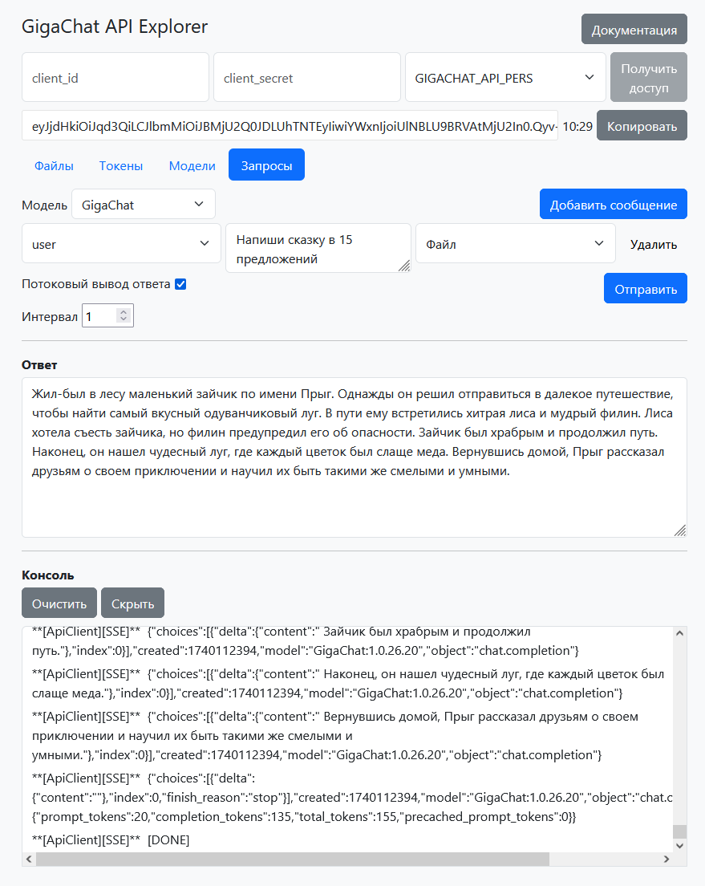

# GigaChat API Explorer

GigaChat API Explorer разработан с целью изучения возможностей, предоставляемых Rest API нейросетевой модели Сбера. В данном приложении реализованы:
- авторизация с применением client_id и client_secret;
- методы работы с файловым хранилищем (загрузка на сервер, удаление, просмотр информации, выгрузка с сервера);
- проверка баланса токенов для каждой из доступных моделей;
- получение списка доступных моделей;
- конструктор запросов к нейросетевой модели

Конструктор запросов включает возможность выбрать режим сетевого взаимодействия: потоковый и стандартный. В случае применения потокового режима, необходимо настроить время интервала задержки между каждым сегментом ответа модели. В конструкторе возможно создать несколько сообщений для разных ролей: доступны user, system и assistant. К сообщениям возможно прикрепление одного файла.

## Интерфейс

## Использование

Приложение можно использовать на своей локальной машине либо по [ссылке](https://determaer.github.io/gigachat-api-explorer/)

Для установки приложения необходимо ввести следующие команды:

` git clone https://github.com/determaer/gigachat-api-explorer `

` npm install `

` npm run dev `

## Документация

Документация к GigaChat API представлена на [официальном сайте](https://developers.sber.ru/docs/ru/gigachat/api/reference/rest/gigachat-api). Также доступ к ней возможно получить из интерфейса приложения по кнопке "Документация"

## Безопасность

В связи с применением proxy-сервера для доставки сообщений API рекомендуется обновлять учётные данные (client_secret) после использования данного приложения
